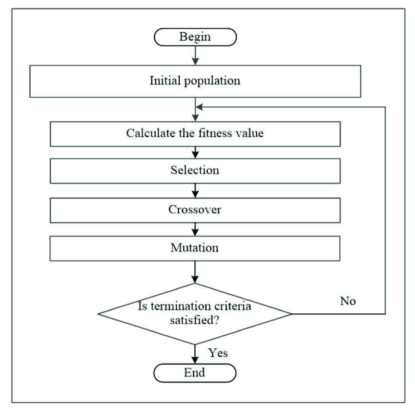
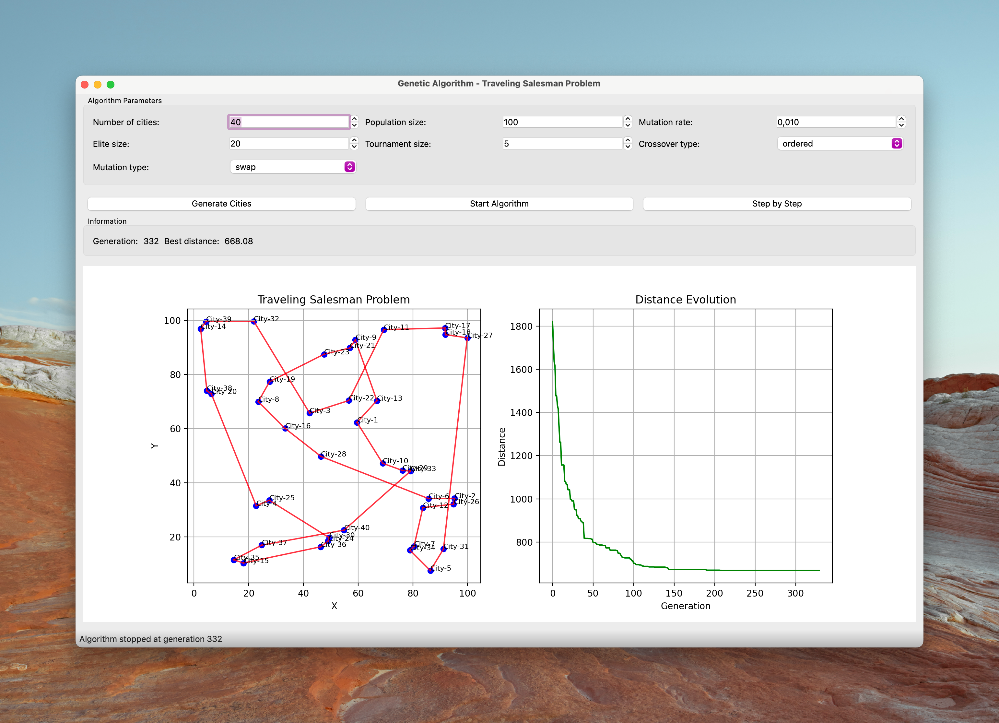

# Traveling Salesman Problem Solver with Genetic Algorithms



A Python implementation of a genetic algorithm to solve the Traveling Salesman Problem (TSP) with multiple selection, crossover, and mutation operators. This implementation is based on established research in evolutionary computation and combinatorial optimization.

## Features

### Multiple Genetic Operators

#### Selection Operators
- **Tournament Selection**: Selects individuals through a tournament of size k
  - Complexity: O(k log k)
  - Based on [Noraini Mohd Razali, John Geraghty, 1995](https://www.iaeng.org/publication/WCE2011/WCE2011_pp1134-1139.pdf)

- **Elitism**: Preserves the n best solutions
  - Ensures monotonic improvement in the best solution
  - [Rudolph, 1994](https://doi.org/10.1109/TEVC.1994.4766865)

#### Crossover Operators
- **Ordered Crossover (OX)**:
  - Preserves relative order of cities
  - Mathematical formulation:
    ```
    Let P₁, P₂ be parents of length n
    Child[i:j] = P₁[i:j]
    Remaining = [x ∈ P₂ | x ∉ P₁[i:j]]
    ```
  - [ABDOUN Otman, ABOUCHABAKA Jaafar, 2011](https://arxiv.org/pdf/1203.3097)

- **Cycle Crossover (CX)**:
  - Preserves absolute positions from both parents by identifying cycles of elements
  - Mathematical formulation:
    ```
    Let P₁, P₂ be parents
    Start with position i=0
    Child[cycle_positions] = P₁[cycle_positions]
    Child[non_cycle_positions] = P₂[non_cycle_positions]
    where cycle_positions = {i, position_of(P₂[i] in P₁), ...} until cycle closes
    ```

#### Mutation Operators
1. **Swap Mutation**
   - Random exchange two adjacent cities
   - Example:
     ```
     Original route: 1 2 3 5 6 4 7 9 8
                        ↕     ↕
     After swap:   1 2 3 6 5 4 7 9 8
     ```
     In this example, cities at positions 4 and 5 (cities 6 and 5) are randomly selected and swapped,
     demonstrating how swap mutation introduces small changes to diversify the population.

2. **Insertion Mutation**
   - Appropriate Combination of Crossover Operator and Mutation Operator in Genetic Algorithms for the Travelling Salesman Problem
   - [Zakir Hussain Ahmed, Habibollah Haron, Abdullah Al-Tameem, 2024](https://www.sciencedirect.com/org/science/article/pii/S1546221824002674)
   - Example:
     ```
     Original route: 1 2 3 4 5 6 7 8 9
                      ↑     ↓
     After insertion: 1 5 2 3 4 6 7 8 9
     ```
     In this example, city 5 is removed from its position and inserted after city 1

3. **Inversion Mutation**
   - Reverses a subsequence of cities
   - Based on biological chromosome inversion
   - Example:
     ```
     Original route: 1 2 3 4 5 6 7 8 9
                        |←-----→|
     After inversion: 1 2 6 5 4 3 7 8 9
     ```
     In this example, the subsequence between positions 3 and 6 is reversed


## User Interface



The application provides an intuitive interface for configuring and running the genetic algorithm:

### Operator Selection
- **Selection Methods**: Choose between Tournament Selection and Elitism
- **Crossover Types**: Select from Ordered Crossover (OX) or Cycle Crossover (CX)
- **Mutation Options**: Pick from Swap, Insertion, or Inversion mutation operators

### Algorithm Parameters
- Adjustable population size
- Customizable mutation and crossover rates
- Generation limit settings

### Visualization
- Real-time route optimization display
- Progress tracking with fitness metrics
- Interactive city placement and map viewing
### Importing TSPLIB Instances
- Possibility of importing TSPLIB instances (.tsp files).
- Here some [documentation](http://comopt.ifi.uni-heidelberg.de/software/TSPLIB95/tsp95.pdf) on TSPLIB instances 

All operators can be mixed and matched to experiment with different genetic algorithm configurations, allowing users to find the most effective combination for their specific TSP instance.